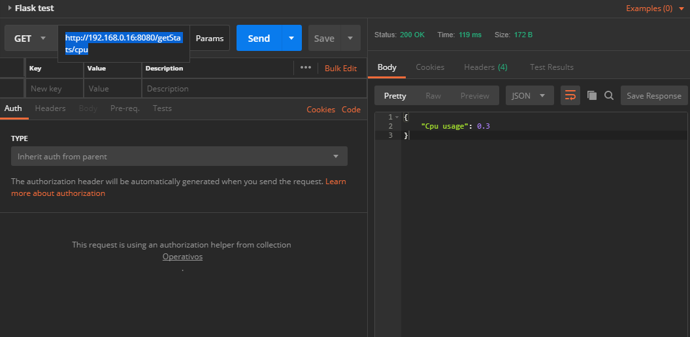
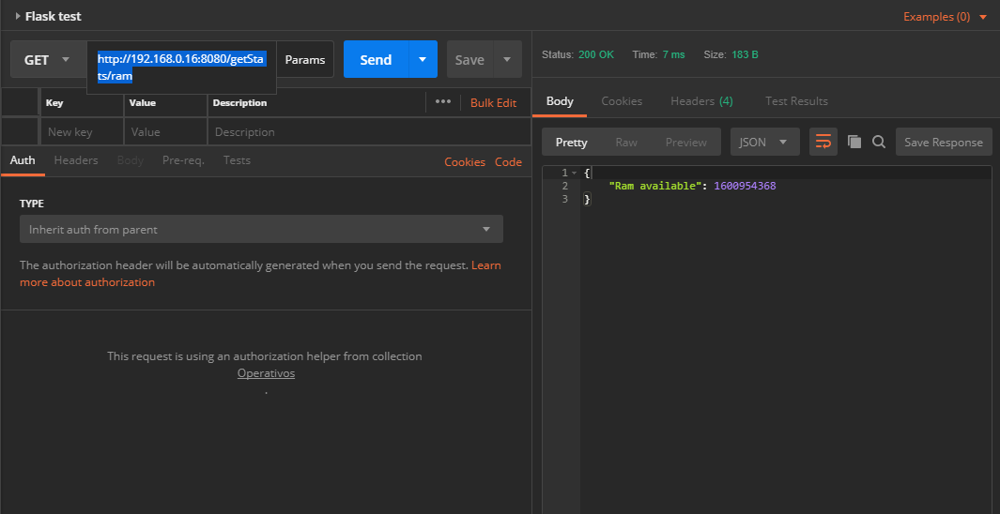
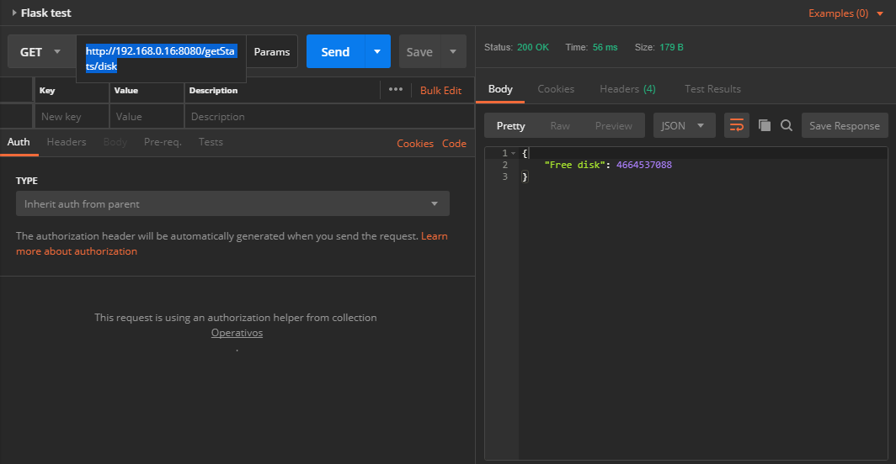
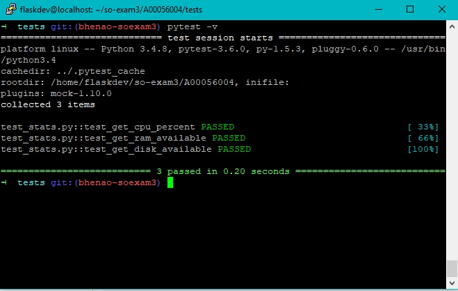
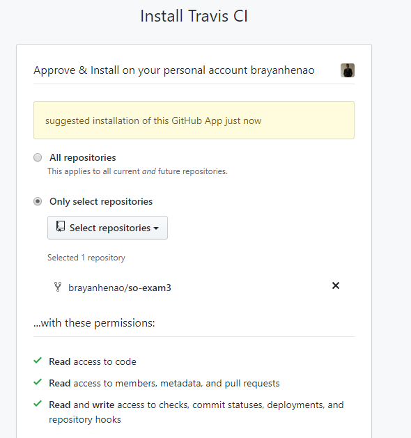

# Sistemas Operacionales - Parcial 3
**Nombre:** Brayan Andrés Henao  
**Código:** A00056004  
**Correo:** bryanhenao96@gmail.com  
**URL Repositorio:** https://github.com/brayanhenao/so-exam3
___

## 3) Servicio web con Flask

Para la creación de un servicio web con flask, se utilizan como base los archivos presentes en el repositorio 
[so-microservices](https://github.com/ICESI-Training/so-microservice), taller realizado en clase para la creación de 
microservicios.

Para los requerimientos del parcial, se requiere además de saber el porcentaje actual de la CPU, obtener la memoria RAM 
utilizada y el espacio en el disco duro disponible, para esto al archivo op_stats/stats.py se le agregan estos dos 
últimos métodos:

```python
import psutil

class Stats():

  @classmethod
  def get_cpu_percent(cls):
    cpu_percent = psutil.cpu_percent()
    return cpu_percent
	
  @classmethod
  def get_ram(cls):
    memory = psutil.virtual_memory();
    available = memory[1]
    return available
  
  @classmethod
  def get_free_disk(cls):
    disk = psutil.disk_usage('/')
    freedisk = disk[2]
    return freedisk
```

Para exponer los servicios mediante Flask, se modifica el archivo op_stats/app.py en donde se agregan los dos nuevos 
servicios a exponer junto con sus rutas de acceso:
```python
from flask import Flask
import json
import sys
sys.path.append('/home/flaskdev/so-exam3/A00056004/')

from op_stats.stats import Stats

app = Flask(__name__)

@app.route('/getStats/cpu')
def get_cpuinfo():
    cpu_percent = Stats.get_cpu_percent()
    return json.dumps({'Cpu usage': cpu_percent})


@app.route('/getStats/ram')
def get_raminfo():
    ram = Stats.get_ram()
    return json.dumps({'Ram available': ram})


@app.route('/getStats/disk')
def get_diskinfo():
    free_disk = Stats.get_free_disk()
    return json.dumps({'Free disk': free_disk})


if __name__ == '__main__':
    app.run(host='0.0.0.0', port=8080)
```
Una vez realizado los cambios en el archivo, se procede a ejecutarlo usando el siguiente comando:
```console
python app.py
```
El cual expondrá el API para ser consumido:
```console
python3 app.py
 * Serving Flask app "app" (lazy loading)
 * Environment: production
   WARNING: Do not use the development server in a production environment.
   Use a production WSGI server instead.
 * Debug mode: off
 * Running on http://0.0.0.0:8080/ (Press CTRL+C to quit)
```

Se utiliza la herramienta [Postman](https://www.getpostman.com/apps) para realizar los llamados al servicio, como se 
evidencia en las siguientes capturas:

##### CPU


##### RAM


##### DISK


## 4) Pruebas unitarias Fixtures y Mocks
Para las requerimientos del parcial, las pruebas unitarias deben contener los servicios antes mencionados, por lo que 
se debe modificar el archivo test/test_stats.py agregando los nuevos servicios a probar:
```python
import pytest
from op_stats.app import app
from op_stats.stats import Stats


@pytest.fixture
def client():
    client = app.test_client()
    return client


def test_get_cpu_percent(mocker, client):
    mocker.patch.object(Stats, 'get_cpu_percent', return_value=100)
    response = client.get('/getStats/cpu')
    assert response.data.decode('utf-8') == '{"Cpu usage": 100}'
    assert response.status_code == 200


def test_get_ram_available(mocker, client):
    mocker.patch.object(Stats, 'get_ram', return_value=3000)
    response = client.get('/getStats/ram')
    assert response.data.decode('utf-8') == '{"Ram available": 3000}'
    assert response.status_code == 200


def test_get_disk_available(mocker, client):
    mocker.patch.object(Stats, 'get_free_disk', return_value=3000)
    response = client.get('/getStats/disk')
    assert response.data.decode('utf-8') == '{"Free disk": 3000}'
    assert response.status_code == 200
```

Una vez realizado los cambios, se ejecuta el siguiente comando para correr las pruebas:
```console
pytest -v
```


## 5) Empleando TravisCI para pruebas unitarias
Se selecciona la herramienta de integración contínua, en este caso [TravisCI](https://travis-ci.com/) y se habilita el 
repositorio de github del parcial para la verificación:


Los archivos necesarios para las pruebas de integración son los siguientes:

#### tox.ini
En este archivo se especifica la información del proyecto, la herramienta para el text (en este caso pytest), la versión
 de python y los requerimientos a instalar (en este caso mediante pio).
```ini
[tox]
envlist = pytest 

[testenv]
basepython = python3

[testenv:pytest]
deps =
  -rrequirements_dev.txt
commands =
  pytest
```

#### .travis.yml
Este archivo se encarga de indicarle a la herramienta de integración contínua (TravisCI) los parámetros de ejecución
de las pruebas, si quiere que se ejecuten como administrador, el lenguaje de programación, si se desea recibir 
notificaciones por e-mail al momento de hacer cada build, la versión de python a ejecutar, lo que se debe instalar y 
el script a ejecutar par las pruebas.                                  
```yaml
sudo: false
language: python
notifications:
  email: false
python:
- '3.4'
install: pip install tox-travis
script: tox -e pytest
```